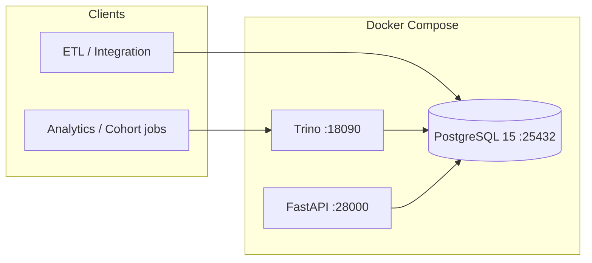

# medinovai-omop-lakehouse

Phase E **OMOP CDM** lakehouse scaffold: **PostgreSQL 15** stores the canonical relational warehouse, **Trino** exposes federated SQL, and a **FastAPI** service provides standard platform health endpoints.

## Architecture



| Component   | Role |
|------------|------|
| PostgreSQL | OMOP CDM v5.4 core tables, indexes, future migrations |
| Trino      | Interactive and batch SQL with pushdown to PostgreSQL |
| FastAPI    | `/health`, `/ready`, future lakehouse APIs |

**Catalog layout**

- **Compose (dev):** `docker/trino/catalog/omop.properties` — JDBC to the `postgres` service (password matches compose).
- **Templated (ops):** `config/trino-catalog-omop.properties` — `${OMOP_DB_*}` placeholders for secrets injection (no production literals in Git).

## Quick start

```bash
bash init.sh
```

Or manually:

```bash
docker compose up -d --build
curl -s http://localhost:28000/health | jq .
```

**Ports (host)**

| Service    | Port  |
|-----------|-------|
| API       | 28000 |
| PostgreSQL | 25432 |
| Trino     | 18090 |

Default database: `omop`, user: `omop`, password: `omop_dev_change_me` (change before any real data).

## OMOP CDM v5.4 tables (core bundle)

Defined in `schema/omop_cdm_v54_core.sql` (from MedinovAI platform brain):

**Clinical / facts**

- `person`
- `visit_occurrence`
- `condition_occurrence`
- `drug_exposure`
- `procedure_occurrence`
- `measurement`
- `observation`

**Vocabulary**

- `concept`
- `concept_relationship`
- `concept_ancestor`

Indexes are included for common filters (e.g. `person_id`, `condition_concept_id`, `concept_code`).

## Trino queries

After `docker compose up -d`, use the [Trino CLI](https://trino.io/docs/current/installation/cli.html) or any JDBC client.

```sql
SHOW CATALOGS;
SHOW SCHEMAS FROM omop;
SHOW TABLES FROM omop.public;
SELECT table_name FROM omop.information_schema.tables
  WHERE table_schema = 'public';
SELECT count(*) AS n FROM omop.public.person;
```

Example join (synthetic / empty DB):

```sql
SELECT v.visit_occurrence_id, v.person_id, v.visit_start_date
FROM omop.public.visit_occurrence v
JOIN omop.public.person p ON p.person_id = v.person_id
LIMIT 10;
```

## PostgreSQL init

- **First boot:** `docker-compose.yml` mounts `schema/omop_cdm_v54_core.sql` into `/docker-entrypoint-initdb.d/`, so the schema is created automatically for a new volume.
- **Manual / CI:** set `POSTGRES_*` and run `config/postgres-init.sh` (executable).

## Harness 2.1

| File | Purpose |
|------|---------|
| `CLAUDE.md` | Repo context for agents (Tier 2) |
| `init.sh` | Start stack and smoke-test API |
| `feature_list.json` | Feature contract (45 items) |
| `claude-progress.txt` | Session log |
| `.claude/settings.json` | Claude Code permissions |
| `.claude/commands/` | `start-session`, `end-session`, `checkpoint` |

## Compliance notes

- Treat this layer as **governed clinical analytics**: use encryption, least-privilege DB roles, and audit for any identifiable data.
- **Never** log raw PHI/PII from APIs, Trino, or application logs—use opaque identifiers only.

## License / ownership

MedinovAI Health — internal platform component.
